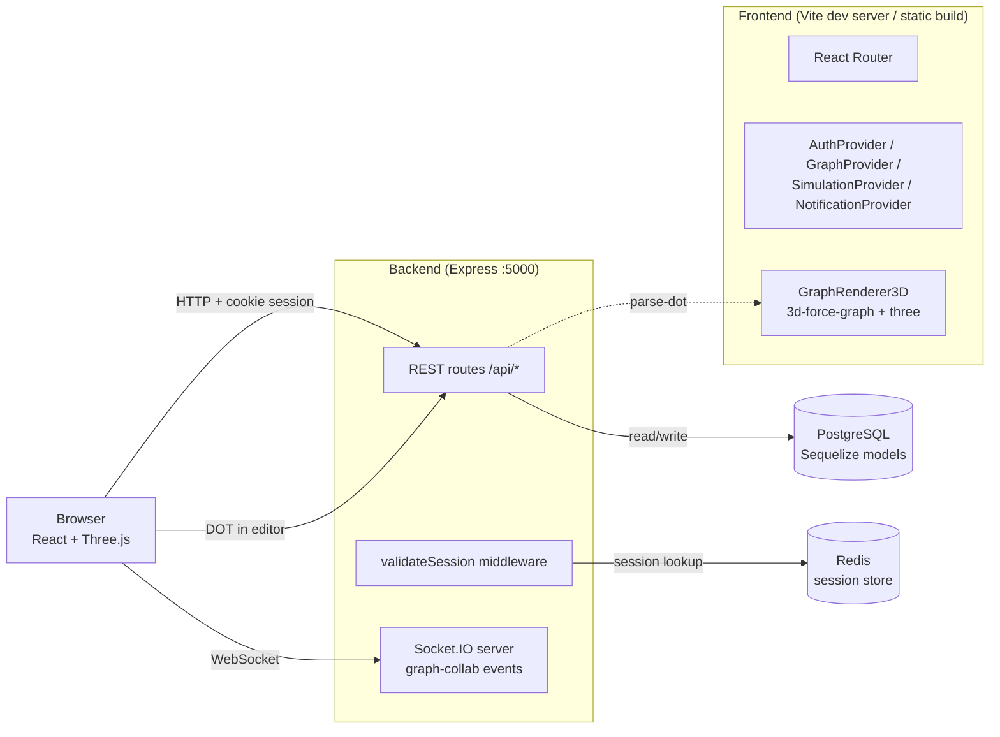
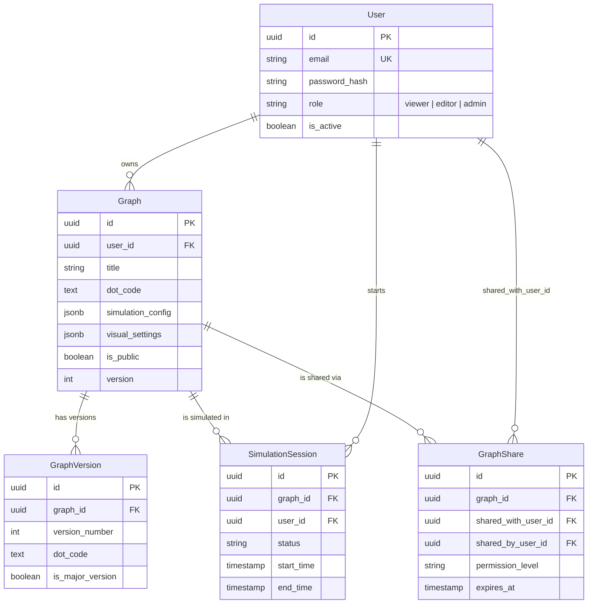

# VortexFlow — Architecture

This document is the **entry point** for understanding how VortexFlow is built.
It links out to the topic-specific docs rather than duplicating them, and only
covers what you can't easily derive by reading the code.

---

## 1. Overview

VortexFlow is a web application for **3D visualization of DOT (Graphviz) graphs
with browser-side data-flow simulation**. It extends the standard DOT language
with VortexFlow-specific attributes (3D geometries, particle generation,
bandwidth/capacity, etc.) and renders them in the browser using Three.js via
[`3d-force-graph`](https://github.com/vasturiano/3d-force-graph).

The repo holds **two independent npm packages** (no monorepo tooling):

| Package | Role | Stack |
|---|---|---|
| `backend/` | REST API + WebSocket + persistence | Node 18+ (CommonJS), Express, Sequelize/Postgres, `express-session` + `connect-redis`, Socket.IO, Winston |
| `frontend/` | SPA + 3D rendering | React 19 + TypeScript 5, Vite, Vitest, MUI, Three.js, `3d-force-graph`, Monaco + CodeMirror |

A `scripts/` folder at the repo root provides start/stop/health scripts that
orchestrate both packages.

---

## 2. System diagram



**Key fact:** the simulation animation runs **entirely in the browser**.
The Socket.IO channel exists but is currently used for graph-collab events
(cursor / chat / graph-update), not for simulation. See section 8.

---

## 3. Request lifecycle

For an authenticated request like `GET /api/graphs`, the backend stack runs in
this exact order (defined in `backend/server.js`):

```
1.  Helmet (CSP allows ws:/wss: for the simulation socket)
2.  CORS (credentials: true, dev-host whitelist)
3.  compression
4.  morgan (piped into Winston)
5.  express-rate-limit (mounted on /api)
6.  express.json + express.urlencoded (10mb limit)
7.  express-session  (Redis store via connect-redis,
                       rolling: true, maxAge clamped to ≥ 1h)
8.  Route mount       (validateSession applied per-mount, see §4)
9.  notFoundHandler / errorHandler (centralized)
```

Public routes (no `validateSession`) are: `/api/auth`, `/api/public`, and
`/api/system/health` — the latter is **mounted before** the protected
`/api/system` mount on purpose, so health probes don't require a session.
Preserve that ordering when adding system routes.

---

## 4. Backend layers

`backend/src/` is laid out as:

```
config/      Sequelize config
middleware/  auth (validateSession + role helpers), errorHandler, asyncHandler
models/      Sequelize models — associations centralized in models/index.js
routes/      One file per /api mount
services/    emailService (Nodemailer)
utils/       logger (Winston), dotValidator, fileUpload (Multer), setup (admin bootstrap)
websocket/   Socket.IO handlers for graph-collab
```

### Routes

| Mount | File | Auth | Notes |
|---|---|---|---|
| `/api/auth` | `routes/auth.js` | public | Login, register, profile |
| `/api/public` | `routes/public.js` | public | Health, version, public graphs |
| `/api/graphs` | `routes/graphs.js` | mixed | Per-route `validateSession` for write ops |
| `/api/users` | `routes/users.js` | `validateSession` | Admin-only checks inside |
| `/api/dashboard` | `routes/dashboard.js` | `validateSession` | |
| `/api/admin` | `routes/admin.js` | own role checks | |
| `/api/system/health` | `routes/system.js` | public | **Special-cased before protected mount** |
| `/api/system/*` | `routes/system.js` | `validateSession` | |
| `/api/import-export` | `routes/import-export.js` | `validateSession` | DOT/JSON/ZIP exchange |

**When adding a model**, register its associations in `models/index.js`, not
inside the model file. That's the convention; the file is the single source of
truth for the relational map.

---

## 5. Frontend layers

Entry: `frontend/src/main.tsx` mounts `<App />`.

### Provider tree (outside-in)

```
ErrorBoundary
  ThemeProvider (custom dark MUI: green #4caf50, orange #ff6b35)
    Router
      AuthProvider
        GraphProvider
          SimulationProvider
            NotificationProvider
              AppLayout
                Routes…
```

New global state should slot **into this tree**, not bypass it. The order
matters: `AuthProvider` sits above `GraphProvider` because graph fetches need
the user's session.

### Routing

Defined in `App.tsx`. Auth pages (`/login`, `/register`) stay eagerly loaded
(small, render before login). The heavy editor / viewer / admin pages are
**lazy-loaded** via `React.lazy` to keep the initial bundle small:

| Path | Component | Auth | Lazy |
|---|---|---|---|
| `/login`, `/register` | `LoginPage`, `RegisterPage` | public-only | no |
| `/dashboard` | `Dashboard` | required | no |
| `/graphs` | `GraphList` | required | no |
| `/graphs/create`, `/graphs/:id/edit` | `GraphEditor` | required | yes |
| `/graphs/:id/view` | `GraphViewer` | required | yes |
| `/profile` | `UserProfile` | required | no |
| `/admin` | `AdminPanel` | admin | yes |

`NO_NAV_PATHS` (`/login`, `/register`, `/forgot-password`, `/reset-password`)
hide the left navigation even when a session is still active — covers the case
of a user manually visiting `/login` to switch accounts.

### Services

| File | Role |
|---|---|
| `services/api.ts` | Axios instance with `withCredentials: true` (session cookies). Error interceptor wired in `App.tsx` via `setupAxiosErrorInterceptor`. |
| `services/websocket.ts` | `socket.io-client` connection. Currently used for graph-collab events. |
| `services/errorHandler.ts` | Central API error formatting. |

### 3D rendering pipeline

DOT source flows through:

```
DOTEditor (Monaco)              backend                  GraphRenderer3D
  user input  ──HTTP──▶  /api/public/parse-dot ──JSON──▶ 3d-force-graph + three.js
                          (dotValidator)                 browser canvas
```

DOT parsing/validation endpoints exist at **two layers** — `/api/public/*`
(unauthenticated, used by the renderer today and by the public landing page)
and `/api/graphs/*` (session-protected, intended for editor flows):

| Route | Auth | Purpose |
|---|---|---|
| `POST /api/public/validate-dot` | public | Syntax check |
| `POST /api/public/parse-dot` | public | Parse to graph structure (called by `GraphRenderer3D`) |
| `GET /api/public/dot-examples` | public | Built-in samples |
| `POST /api/graphs/validate-dot` | session | Same as public, available to authenticated editor |
| `POST /api/graphs/parse-dot` | session | Same as public, available to authenticated editor |
| `GET /api/graphs/dot-examples` | session | Same as public |

The duplication is a known piece of debt — the two layers do the same thing
and the renderer arguably should hit the session-protected one when the user
is logged in.

The renderer (`components/graphs/GraphRenderer3D.tsx`) carries several
non-obvious behaviors that **must be preserved** when touching it
(auto-zoom timing, particle-material patch, particle-emit one-shot vs
continuous, stats fallback for plain DOT). See the *load-bearing behaviors*
section in the contributing notes (and code comments at the call sites).

### Vite chunk split

`vite.config.ts` defines a manual chunk split:

| Chunk | Contents | Why |
|---|---|---|
| `three` | `three`, `3d-force-graph`, `three-spritetext` | Heavy stack only used in `GraphRenderer3D`, isolated for caching |
| `codemirror` | `@codemirror/*`, `@uiw/react-codemirror` | Heavy editor stack, isolated for caching |

Don't merge them back into the default chunk without a reason.

---

## 6. Data model



Associations are wired in `backend/src/models/index.js`. The `SimulationSession`
model is preserved for a possible future server-driven simulation feature; it
is currently not written to by the running app (see §8).

---

## 7. Auth & sessions

- **Session-based, no JWTs.** Server-side state in Redis via `connect-redis`,
  cookie name `SESSION_NAME` (default `vortexflow-session`), `httpOnly`,
  `secure` only in production, `rolling: true` (sliding expiration). `maxAge`
  is clamped to a minimum of 1 hour.
- **Roles:** `viewer | editor | admin`. Helpers in `middleware/auth.js`.
- **ProtectedRoute** (frontend, `App.tsx`) reads `useAuth().state.user` and
  redirects to `/login` (or `/dashboard` if `requireAuth: false` and a session
  exists, or back to `/dashboard` if `requireAdmin` and the user isn't admin).
- **Admin bootstrap.** On startup, `utils/setup.js::setupAdminUser()` creates
  an admin from `ADMIN_EMAIL` / `ADMIN_PASSWORD` env vars if no admin exists.
  The default value in `.env.example` is **public** — it must be changed for
  any non-local deployment. (A dev/prod split guard is planned, see the
  remediation roadmap.)

For the full request flow, see [`backend/doc/AUTHENTICATION.md`](./backend/doc/AUTHENTICATION.md).

---

## 8. Simulation pipeline (browser-side)

The simulation animation runs **entirely client-side**:

- `GraphContext.startSimulation / pause / stop` only flip a local
  `simulationState` flag. They do **not** call `/api/simulation/*` and do
  **not** emit on the socket.
- The actual particle animation, per-frame accumulation, and stats are
  computed in `frontend/src/components/graphs/GraphRenderer3D.tsx` using
  `3d-force-graph` directional particles + custom Three.js scene walks.
- The backend's `routes/simulation.js` and `websocket/simulationHandler.js`
  were **removed** in commit `542db32` (*Fix tests UUID + supprime l'infra
  simulation backend dormante*). The `SimulationSession` Sequelize model is
  kept for a possible future feature.

The Socket.IO channel is now used for **graph-collab** events (cursor
positions, chat, live graph updates). CORS for the socket is restricted to
`FRONTEND_URL`.

---

## 9. DOT 3D extensions — **the triple invariant**

VortexFlow extends standard DOT with attributes for 3D geometries, particle
flow, and simulation parameters. These extensions live in **three places**,
each with a distinct role:

| Lieu | Role | File(s) |
|---|---|---|
| **Validator** *(the gate)* | Decides which attributes / shapes / geometries are valid | `backend/src/utils/dotValidator.js` |
| **Renderer** *(the consumer)* | Reads the attributes and turns them into 3D effects | `frontend/src/components/graphs/GraphRenderer3D.tsx` |
| **Specification** *(the reference)* | Describes the language for users | `doc/dot-3d/` (`grammar-specification.md`, `bnf-grammar.md`, `validation-rules.md`, `user-guide.md`, `examples/*.dot`) |

These three **must stay in sync**. If you add or change an attribute and
update only one of the three, you create a subtle bug:

| If you forget… | Symptom |
|---|---|
| the **validator** | The spec advertises an attribute, but the API rejects graphs that use it. |
| the **renderer** | Validation passes, but the 3D scene ignores the attribute — silent no-op. |
| the **spec** | The feature exists in code but no user can discover it. |

### Currently supported VortexFlow attributes

- **Legacy flow attributes:** `flow_rate, capacity, latency, bandwidth, packet_size, processing_time, queue_size, failure_rate, recovery_time, priority`
- **3D extensions:** `geometry, dimensions, particleGeneration, maxParticleProcessing, particleSpeed, maxParticleFlow, image, autoResize, bloomEffect, particlesEnabled, autoColors, defaultNodeSize`
- **3D geometries:** `Sphere, Box, Cylinder, Cone, Torus`

### Checklist for adding a new attribute

```
1. Add the attribute to the validator whitelist + validation rules
   → backend/src/utils/dotValidator.js
   → unit test in backend/tests/unit/utils/dotValidator.test.js

2. Implement the attribute's 3D effect in the renderer
   → frontend/src/components/graphs/GraphRenderer3D.tsx
   → covered by an integration check (load a sample .dot, assert the effect)

3. Document the attribute
   → doc/dot-3d/grammar-specification.md  (formal entry)
   → doc/dot-3d/validation-rules.md       (acceptable values / ranges)
   → doc/dot-3d/user-guide.md             (prose explanation + example)
   → doc/dot-3d/examples/                 (a .dot file demonstrating it)
```

The detailed spec — formal grammar (BNF), validation rules, examples — lives
in [`doc/dot-3d/`](./doc/dot-3d/). This section only states the invariant and
its checklist; do not duplicate the spec here.

---

## 10. Cross-cutting concerns

| Concern | Where | Notes |
|---|---|---|
| **Logging** | `backend/src/utils/logger.js` (Winston) | Use it instead of `console.*` in backend code. Morgan is piped into it. |
| **Error handling** | `backend/src/middleware/errorHandler.js` (`notFoundHandler` + `errorHandler`) | Always last in the middleware chain. Frontend has `ErrorBoundary` + `setupAxiosErrorInterceptor`. |
| **Rate limiting** | `express-rate-limit` mounted on `/api`. | Default: 100 req / 15 min. Tunable via `RATE_LIMIT_WINDOW_MS` / `RATE_LIMIT_MAX_REQUESTS`. |
| **File uploads** | `backend/src/utils/fileUpload.js` (Multer) → `backend/uploads/`, served at `/uploads`. | The module installs a 1h cleanup `setInterval` — use `jest.useFakeTimers()` before requiring it in tests. |
| **CSP** | Helmet config in `server.js`. Allows `ws:` / `wss:` for the simulation socket. | Tightening is planned. |
| **CORS** | `cors` middleware. In prod, restricted to `FRONTEND_URL`; in dev, also `localhost:3000` and `127.0.0.1:3000`. | |

---

## 11. Pointers

| Topic | Doc |
|---|---|
| Build & deploy | [`doc/DEPLOYMENT.md`](./doc/DEPLOYMENT.md) (root) — the older [`backend/doc/DEPLOYMENT.md`](./backend/doc/DEPLOYMENT.md) is being deduplicated |
| Environment & configuration | [`doc/SETUP_ENV_GUIDE.md`](./doc/SETUP_ENV_GUIDE.md) + [`backend/doc/CONFIGURATION.md`](./backend/doc/CONFIGURATION.md) |
| Authentication & sessions | [`backend/doc/AUTHENTICATION.md`](./backend/doc/AUTHENTICATION.md) |
| REST API reference | [`backend/doc/API_DOCUMENTATION.md`](./backend/doc/API_DOCUMENTATION.md) |
| Backend development guide | [`backend/doc/DEVELOPMENT.md`](./backend/doc/DEVELOPMENT.md) |
| DOT 3D specification | [`doc/dot-3d/`](./doc/dot-3d/) |
| Day-by-day changelog | [`doc/changelog/`](./doc/changelog/) |
| Coding conventions | `doc/STYLE_GUIDE.md` *(planned, chantier 2.2)* |
| Architecture decisions | `doc/adr/` *(planned, chantier 2.3)* |
| Contribution workflow | [`CONTRIBUTING.md`](./CONTRIBUTING.md) |
