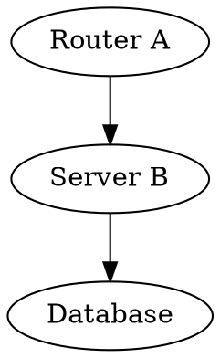

# VortexFlow

**Application web de visualisation 3D de graphiques DOT avec simulation de flux de données**

VortexFlow permet de créer, visualiser et simuler des graphiques 3D interactifs à partir du langage DOT (Graphviz) avec des extensions pour la simulation de flux de données.

## 🌟 Fonctionnalités Principales

- **Visualisation 3D interactive** avec Three.js
- **Simulation de flux de données** en temps réel avec particules animées  
- **Éditeur DOT avancé** avec syntaxe étendue pour les simulations
- **Système d'authentification multi-rôles** (viewer/editor/admin)
- **Gestion collaborative** avec partage de graphiques
- **Interface moderne et responsive**

## 🚀 Stack Technique

### Backend
- Node.js avec Express.js
- PostgreSQL avec Sequelize ORM
- Redis pour sessions et cache
- Sessions serveur sécurisées
- API REST complète

### Frontend  
- React.js avec hooks modernes
- Three.js pour la visualisation 3D
- react-force-graph-3d pour les graphiques
- Material-UI pour l'interface
- Monaco Editor pour l'éditeur de code

### Infrastructure
- Docker & Docker Compose
- Tests avec Jest
- Documentation complète

## 📦 Installation

### Prérequis
- Node.js 18+
- Docker & Docker Compose
- PostgreSQL 14+
- Redis 6+

### Installation avec Docker (Recommandé)

```bash
# Cloner le projet
git clone <repository-url>
cd VortexFlow

# Configurer l'environnement
cp .env.example .env
# Éditer .env avec vos paramètres

# Démarrer avec Docker
docker-compose up -d

# L'application sera disponible sur http://localhost:3000
```

### Installation manuelle

```bash
# Backend
cd backend
npm install
npm run setup-db
npm run dev

# Frontend (dans un autre terminal)
cd frontend  
npm install
npm start
```

## 🔑 Compte Administrateur Par Défaut

Un compte administrateur est automatiquement créé lors de l'installation :
- **Email** : admin@admin.com
- **Mot de passe** : VortexFlow2024!

⚠️ **Important** : Changez le mot de passe lors de la première connexion !

## 🎯 Utilisation

### 1. Connexion
Connectez-vous avec le compte admin ou créez un nouveau compte utilisateur.

### 2. Création d'un Graphique


### 3. Simulation Interactive
- Utilisez les contrôles play/pause/reset
- Ajustez la vitesse de simulation
- Observez les flux de données en temps réel
- Analysez les métriques de performance

## 🏗️ Architecture

```
VortexFlow/
├── backend/          # API Node.js/Express
├── frontend/         # Interface React
├── database/         # Schémas et migrations
├── docker/          # Configuration Docker
├── doc/            # Documentation
└── tests/           # Tests automatisés
```

## 🧪 Tests

```bash
# Tests backend
cd backend && npm test

# Tests frontend  
cd frontend && npm test

# Tests d'intégration
npm run test:integration
```

## 📚 Documentation

- [Guide Utilisateur](doc/user-guide.md)
- [API Documentation](doc/api.md)
- [Guide Développeur](doc/developer-guide.md)
- [Syntaxe DOT Étendue](doc/dot-syntax.md)

## 🔒 Sécurité

- Sessions serveur sécurisées avec Redis
- Mots de passe hachés avec bcrypt
- Protection CSRF et XSS
- Rate limiting sur les APIs
- Validation stricte des entrées

## 🤝 Contribution

1. Fork le projet
2. Créez une branche feature (`git checkout -b feature/AmazingFeature`)
3. Committez vos changements (`git commit -m 'Add AmazingFeature'`)
4. Push vers la branche (`git push origin feature/AmazingFeature`)
5. Ouvrez une Pull Request

## 📄 Licence

Ce projet est sous licence MIT. Voir le fichier `LICENSE` pour plus de détails.

## 🆘 Support

Pour toute question ou problème :
- Ouvrez une issue sur GitHub
- Consultez la documentation
- Contactez l'équipe de développement

---

**VortexFlow** - Visualisez vos données comme jamais auparavant ! 🌊✨

---

## 🎉 État du Développement Backend

### ✅ **BACKEND COMPLET ET FONCTIONNEL**

Le backend VortexFlow est maintenant **entièrement développé** avec toutes les fonctionnalités demandées :

#### 🔥 **Fonctionnalités Implémentées**
- **✅ API REST complète** - 40+ endpoints sécurisés
- **✅ Authentification multi-rôles** - viewer/editor/admin avec sessions Redis
- **✅ Gestion des graphiques DOT** - CRUD, versions, partage, validation
- **✅ Simulations temps réel** - WebSocket avec Socket.IO
- **✅ Validateur DOT avancé** - Syntaxe + extensions VortexFlow
- **✅ Import/Export** - DOT, JSON, ZIP multi-graphiques
- **✅ Administration système** - Stats, logs, monitoring, cleanup
- **✅ Service email** - Templates HTML, notifications automatiques
- **✅ Gestion des fichiers** - Upload sécurisé, validation, cleanup
- **✅ Sécurité** - Rate limiting, validation, sanitization, CORS
- **✅ Architecture modulaire** - Middleware, services, utilitaires
- **✅ Documentation complète** - README détaillé + JSDoc

#### 🏗️ **Architecture Robuste**
```
backend/
├── src/
│   ├── models/          # 📊 Modèles Sequelize (PostgreSQL)
│   ├── routes/          # 🛣️ 6 groupes de routes API
│   ├── middleware/      # 🛡️ Sécurité et validation
│   ├── utils/           # 🔧 Utilitaires (DOT validator, logger)
│   ├── services/        # 📧 Services (email, etc.)
│   └── websocket/       # ⚡ WebSocket handlers
├── scripts/             # 🚀 Scripts de démarrage
└── README.md            # 📚 Documentation complète
```

#### 🌐 **API Endpoints Disponibles**
- **`/api/auth`** - Authentification (register, login, profile)
- **`/api/graphs`** - Gestion des graphiques (CRUD, versions, partage)
- **`/api/users`** - Administration utilisateurs (admin uniquement)
- **`/api/simulation`** - Sessions de simulation (démarrage, contrôle)
- **`/api/import-export`** - Import/export de graphiques
- **`/api/system`** - Administration système (health, stats, logs)

#### ⚡ **WebSocket Events**
- Simulation temps réel : `start_simulation`, `pause_simulation`, etc.
- Diffusion d'événements : `simulation_update`, `simulation_error`
- Gestion des connexions et cleanup automatique

### 🚀 **Démarrage Backend**

```bash
# 1. Aller dans le dossier backend
cd backend/

# 2. Installer les dépendances
npm install

# 3. Configurer l'environnement
cp .env.example .env
# Modifier .env avec vos paramètres

# 4. Démarrer en développement
./scripts/start-dev.sh
# ou
npm run dev
```

### 📚 **Documentation Backend Complète**

**✅ Organisation finalisée le 2025-07-07**  
Toute la documentation backend est maintenant parfaitement organisée dans [`backend/doc/`](./backend/doc/) :

- **📖 [Index Documentation](./backend/doc/README.md)** - Vue d'ensemble complète
- **🚀 [API Documentation](./backend/doc/API_DOCUMENTATION.md)** - Référence API REST
- **🔐 [Authentication Guide](./backend/doc/AUTHENTICATION.md)** - Sessions et sécurité
- **⚙️ [Configuration Guide](./backend/doc/CONFIGURATION.md)** - Variables d'environnement
- **🐳 [Deployment Guide](./backend/doc/DEPLOYMENT.md)** - Déploiement production
- **💻 [Development Guide](./backend/doc/DEVELOPMENT.md)** - Guide développement
- **🔧 Script de navigation** : `./backend/browse-docs.sh`

### 📋 **Prochaines Étapes**

1. **✅ Backend + Documentation terminés** - Production ready
2. **🔄 Frontend React** - Interface utilisateur 3D avec Three.js
3. **🐳 Containerisation** - Docker setup complet (backend + frontend)
4. **🚀 Déploiement** - Pipeline CI/CD et hosting

---
