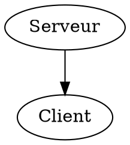
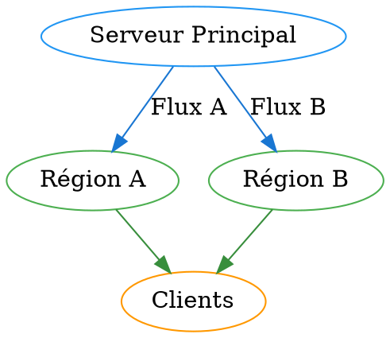
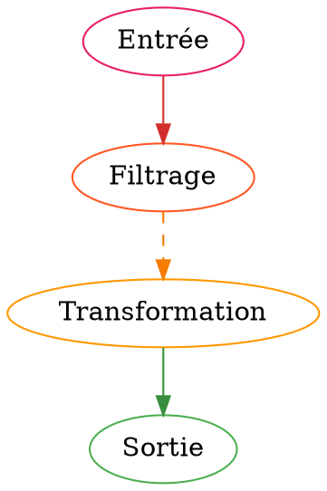

# Guide Utilisateur - Grammaire DOT 3D avec Particules

## Introduction

Ce guide vous explique comment créer des visualisations 3D interactives avec simulation de particules en utilisant la syntaxe DOT étendue dans VortexFlow.

---

## 🚀 Démarrage Rapide

### Votre Premier Graphique 3D



### Résultat

- **Serveur A** : Cube générant 30 particules/minute
- **Client B** : Sphère traitant jusqu'à 60 particules/minute
- **Flux** : 20 particules max/minute à vitesse 1.2x

---

## 📐 Géométries 3D Disponibles

### 1. Sphere (Sphère)

```dot
NodeSphere [
    geometry="Sphere",
    dimensions="{radius: 1.5}",
    color="#4CAF50"
];
```

### 2. Box (Boîte/Cube)

```dot
NodeBox [
    geometry="Box",
    dimensions="{width: 2.0, height: 1.0, depth: 1.5}",
    color="#2196F3"
];
```

### 3. Cylinder (Cylindre)

```dot
NodeCylinder [
    geometry="Cylinder",
    dimensions="{radius: 0.8, height: 2.5}",
    color="#FF9800"
];
```

### 4. Cone (Cône)

```dot
NodeCone [
    geometry="Cone",
    dimensions="{radius: 1.2, height: 2.0}",
    color="#9C27B0"
];
```

### 5. Torus (Tore)

```dot
NodeTorus [
    geometry="Torus",
    dimensions="{tube: 0.3, tubularSegments: 8, radialSegments: 6}",
    color="#F44336"
];
```

---

## ⚡ Système de Particules

> 🆕 **Depuis ADR-006**, la simulation est événementielle (DES) : seuls les
> nœuds dont le rôle est explicitement `generator` émettent des particules.
> Les nœuds sans `nodeRole` sont considérés comme `relay` (ils transmettent
> sans émettre). Un graphe sans aucun `generator` reste statique.

### Rôles des nœuds (`nodeRole`)

| Valeur             | Comportement                                                                          | Cas d'usage typique               |
| ------------------ | ------------------------------------------------------------------------------------- | --------------------------------- |
| `generator`        | Émet des particules à `particleGeneration` p/s. Peut aussi router son trafic entrant. | Source, capteur, client émetteur  |
| `relay` _(défaut)_ | Reçoit, met en file, traite, route vers les liens sortants.                           | Routeur, processeur intermédiaire |
| `sink`             | Absorbe les particules à l'arrivée, ne route rien.                                    | Destination finale, log, drain    |

### Configuration des Nœuds

#### Nœud Générateur

```dot
Generator [
    label="Générateur",
    nodeRole="generator",
    particleGeneration=2,          // 2 particules/seconde
    maxParticleProcessing=60,      // Traite 60 max/seconde (s'il reçoit aussi)
    geometry="Cone",
    color="#ff4444"
];
```

#### Nœud Processeur (relay)

```dot
Processor [
    label="Processeur",
    // nodeRole non précisé → relay par défaut
    maxParticleProcessing=200,     // Traite 200 max/seconde
    queue_size=100,                // File limitée à 100
    dropPolicy="tail",             // Drop l'entrante quand pleine
    processing_time=5,             // 5 ms par particule
    geometry="Box",
    color="#44ff44"
];
```

#### Nœud Tampon avec drop visible

```dot
Buffer [
    label="Tampon saturable",
    nodeRole="relay",
    maxParticleProcessing=15,      // Traite lentement
    queue_size=20,                 // File petite
    dropPolicy="head",             // Drop la plus ancienne
    failure_rate=0.02,             // 2 % d'échec à la sortie
    geometry="Cylinder",
    color="#4444ff"
];
```

#### Nœud Puits

```dot
Sink [
    label="Destination",
    nodeRole="sink",
    geometry="Sphere",
    color="#888888"
];
```

### Cumul et drop : ce qui se passe à l'écran

- **Accumulation** : la taille visuelle d'un nœud croît avec son nombre de
  particules en file (jusqu'à 2× sa taille de base à saturation).
- **Halo de saturation** : orange si file > 80 % de `queue_size`, rouge si pleine.
- **Drop** : flash rouge bref + compteur incrémenté sur le nœud.
- **Stats HUD** : `Drops` ajouté à côté de `Particules / Latence / Goulots`,
  alimenté en temps réel par le simulator.

### Configuration des Liens

```dot
// Flux rapide
Generator -> Processor [
    maxParticleFlow=100,           // 100 max particules/minute
    particleSpeed=2.0,             // Vitesse doublée
    color="#00ff00",
    style="solid"
];

// Flux lent avec goulot d'étranglement
Processor -> Buffer [
    maxParticleFlow=20,            // Seulement 20/minute
    particleSpeed=0.5,             // Vitesse réduite
    color="#ffaa00",
    style="dashed"
];
```

---

## 🎨 Styles et Apparence

### Couleurs Supportées

#### Format Hexadécimal

```dot
A [color="#ff0000"];  // Rouge
B [color="#00ff00"];  // Vert
C [color="#0000ff"];  // Bleu
```

#### Format RGB

```dot
A [color="rgb(255, 0, 0)"];    // Rouge
B [color="rgb(0, 255, 0)"];    // Vert
C [color="rgb(0, 0, 255)"];    // Bleu
```

#### Couleurs Nommées

```dot
A [color="red"];
B [color="green"];
C [color="blue"];
D [color="orange"];
E [color="purple"];
```

### Styles de Liens

```dot
// Lien solide (défaut)
A -> B [style="solid"];

// Lien pointillé
A -> C [style="dashed"];

// Lien en points
A -> D [style="dotted"];
```

---

## 🔧 Configuration Globale

### Paramètres Disponibles

```dot
digraph NetworkSimulation {
    // Taille de base des nœuds
    defaultNodeSize = 1.5;

    // Activation système particules
    particlesEnabled = true;

    // Redimensionnement automatique selon connexions
    autoResize = true;

    // Effet bloom sur accumulation
    bloomEffect = true;

    // Attribution couleurs automatique
    autoColors = false;  // Désactivé pour couleurs manuelles

    // Vos nœuds et liens...
}
```

### Effet du Redimensionnement Automatique

Avec `autoResize = true`, la taille des nœuds s'adapte :

```
taille_finale = defaultNodeSize × (1 + 0.1 × √(connexions_entrantes))
```

**Exemples :**

- 0 connexion : taille = 1.0 × (1 + 0) = **1.0**
- 4 connexions : taille = 1.0 × (1 + 0.2) = **1.2**
- 16 connexions : taille = 1.0 × (1 + 0.4) = **1.4**

---

## 📊 Surveillance et Métriques

### États des Particules

#### Accumulation Normale

```dot
NormalNode [
    particleGeneration=60,
    maxParticleProcessing=80      // Traite plus qu'il ne génère
];
```

#### Accumulation Critique

```dot
BottleneckNode [
    particleGeneration=100,
    maxParticleProcessing=40      // Génère plus qu'il ne traite
];
```

### Effet Bloom

Quand l'accumulation dépasse 80 particules, le nœud commence à "briller" :

- **Accumulation 0-80** : Apparence normale
- **Accumulation 80-100** : Effet bloom progressif
- **Accumulation >100** : Bloom maximum (intensité 1.0)

---

## 💡 Exemples Pratiques Complets

### Exemple 1 : Réseau de Distribution



### Exemple 2 : Pipeline de Traitement



---

## 🔍 Debugging et Validation

### Messages d'Erreur Courants

#### Erreur de Géométrie

```
❌ Erreur ligne 12: geometry "InvalidShape" non supportée
   Géométries supportées: Sphere, Box, Cylinder, Cone, Torus
```

#### Erreur de Dimensions

```
❌ Erreur ligne 15: dimensions manquantes pour geometry="Box"
   Box requiert: width, height, depth
```

#### Erreur de Contraintes

```
❌ Erreur ligne 8: particleGeneration ne peut pas être négatif
   Valeur reçue: -10, minimum requis: 0
```

### Validation Réussie

```
✅ Graphique validé avec succès
   • 8 nœuds détectés
   • 12 liens configurés
   • Système particules: activé
   • Géométries: 3 Box, 2 Sphere, 2 Cylinder, 1 Cone
```

---

## 🎮 Utilisation dans VortexFlow

### 1. Édition

- Ouvrez l'**Éditeur de Graphiques**
- Sélectionnez le mode **"DOT 3D"**
- Saisissez votre code DOT étendu
- La validation se fait en temps réel

### 2. Prévisualisation

- Cliquez sur **"Aperçu 3D"**
- Le graphique s'affiche avec géométries et particules
- Le **panneau de contrôle** permet d'ajuster les paramètres

### 3. Simulation

- Lancez la simulation avec **"Démarrer"**
- Observez les particules circuler en temps réel
- Consultez les métriques dans le panneau

### 4. Optimisation

- Utilisez les contrôles pour ajuster :
  - Taille des nœuds
  - Espacement
  - Vitesse de simulation
  - Effets visuels

---

## 📈 Conseils d'Optimisation

### Performance

1. **Limitez les particules** : Commencez par de petites valeurs
2. **Géométries simples** : Sphere et Box sont plus rapides
3. **Bloom modéré** : Accumulation <200 pour performance optimale

### Visibilité

1. **Couleurs contrastées** : Évitez les couleurs trop similaires
2. **Tailles variées** : Utilisez autoResize pour hiérarchiser
3. **Labels courts** : Textes concis pour lisibilité

### Debugging

1. **Validation fréquente** : Testez après chaque modification
2. **Accumulation graduelle** : Ajoutez les features une par une
3. **Métriques actives** : Surveillez les statistiques temps réel

---

Vous êtes maintenant prêts à créer des visualisations 3D spectaculaires avec la grammaire DOT étendue ! 🚀
