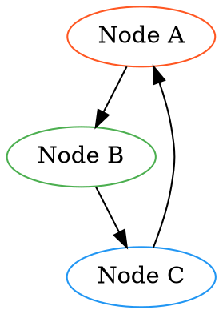
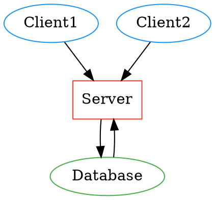
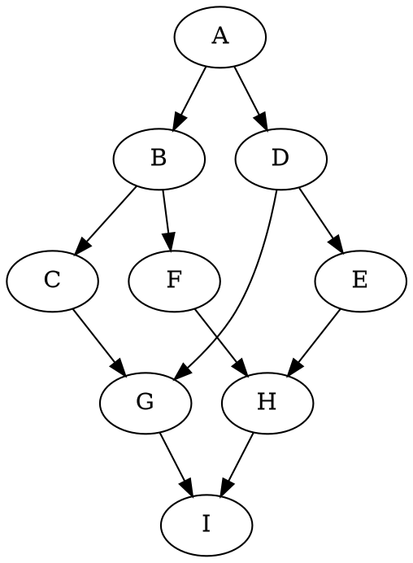

# Test DOT Graph Preview

## Simple Graph Test

```dot
digraph Simple {
  A -> B
  B -> C
  C -> A
  A [label="Node A" color="#FF5722"]
  B [label="Node B" color="#4CAF50"]
  C [label="Node C" color="#2196F3"]
}
```

## Network Graph Test

```dot
digraph Network {
  Server [shape=box color="#F44336"]
  Database [shape=ellipse color="#4CAF50"]
  Client1 [color="#2196F3"]
  Client2 [color="#2196F3"]
  
  Server -> Database
  Client1 -> Server
  Client2 -> Server
  Database -> Server
}
```

## Complex Graph Test

```dot
digraph Complex {
  A -> B -> C
  A -> D -> E
  B -> F
  C -> G
  D -> G
  E -> H
  F -> H
  G -> I
  H -> I
}
```
